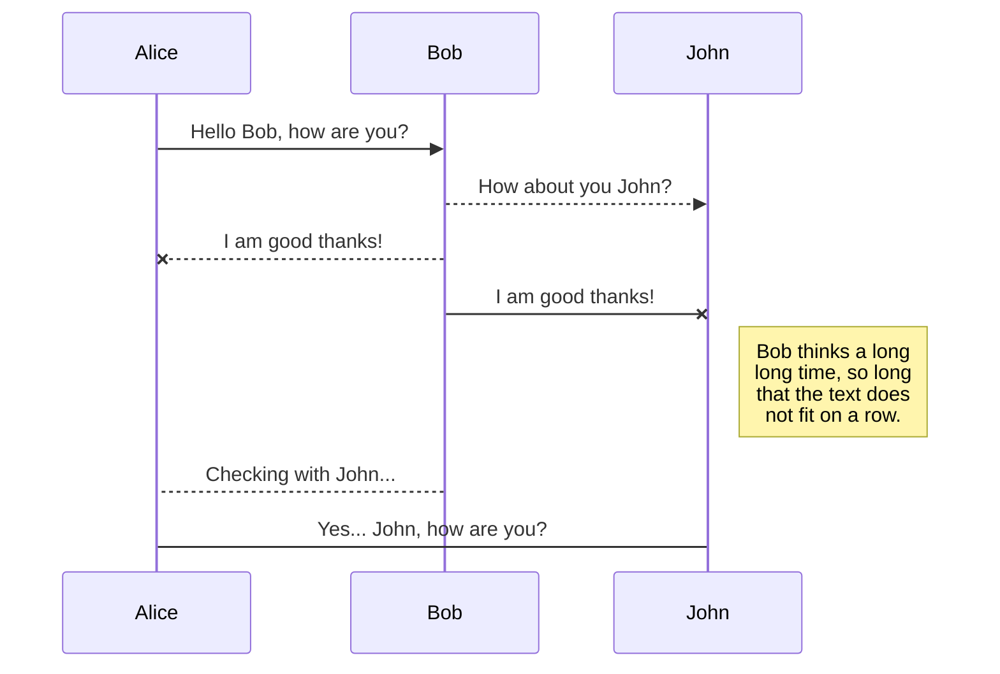
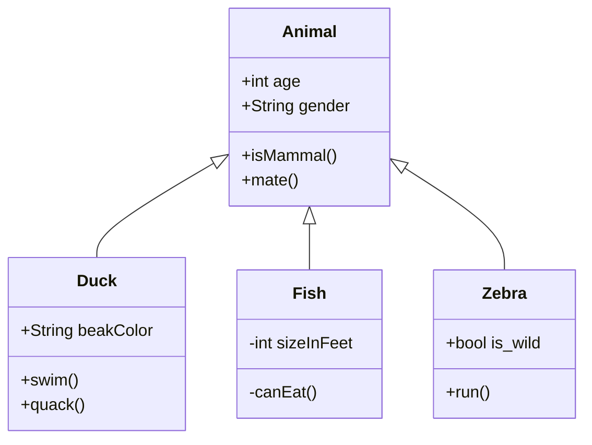

# menu

- [演示](./examples/intro.md)
- [帮助](./examples/help.md)

# contents

## 文殊Web(Manju-web)

文殊Web是一款文档组织工具，把由Markdown编辑的文档组织成一个静态网站。文殊Web支持LaTex、Mermaid等各类DSL语言（领域语言）。

### 数学公式

**欧拉公式**
$$
e^{i\pi}+1=0
$$
**矩阵**
$$
\begin{pmatrix}
 1 & a_1 & a_1^2 & \cdots & a_1^n \\\\
 1 & a_2 & a_2^2 & \cdots & a_2^n \\\\
 \vdots  & \vdots& \vdots & \ddots & \vdots \\\\
 1 & a_m & a_m^2 & \cdots & a_m^n    
 \end{pmatrix}
$$

**平方和公式**
$$
\sum_{i=0}^n i^2 = \frac{(n^2+n)(2n+1)}{6}
$$

### Mermaid

**序列图**

**类图**

